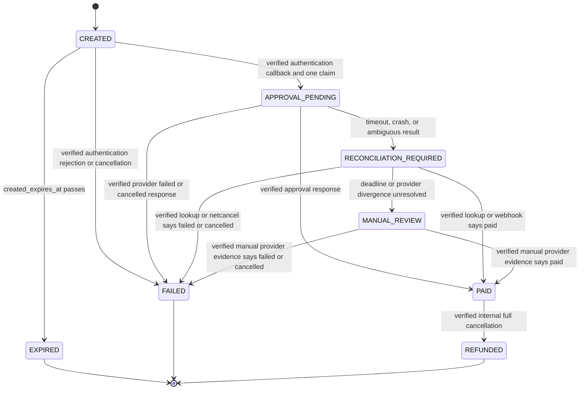

# LinkPay V2 Payment Flow — Technical Contract

**Status:** Decision draft v0.2
**Date:** 2026-07-28
**Companion:** [Easy Korean guide](./linkpay-v2-payment-flow.ko.md)
**Purpose:** Define one safe, understandable LinkPay payment model before any payment code or migration is written.

This is the canonical technical description for the new LinkPay payment path. It starts from `dev` and deliberately does **not** reuse any unique work from `feat-admin-payment`.

## 1. Phase 1 boundary

- LinkPay only. The ordinary `/order` checkout is a separate project.
- NICEPAY Start **payment-window, Server Approval** model using Basic authentication.
- Credit/debit card payments only, in KRW.
- The administrator fixes the amount before sharing the link. The browser cannot choose or alter it.
- One link can have several terminal `FAILED` or `EXPIRED` attempts, but at most one successfully charged attempt in its entire history.
- Phase 1 supports a full cancellation of the original paid card transaction only. Partial cancellation, virtual accounts, subscriptions, and sales analytics are out of scope.
- A paid or refunded link is never reusable. A new charge requires a new link.
- The result page shows only a NICEPAY-verified state durably stored by our server. A redirect, query string, popup callback, or browser state is never payment proof.

## 2. Actors and trust boundary

| Actor            | Responsibility                                                                               | Must never do                                                                                 |
| ---------------- | -------------------------------------------------------------------------------------------- | --------------------------------------------------------------------------------------------- |
| Administrator    | Creates, disables, views, and—when authorized—fully refunds fixed-price links                | Change commercial fields after the first attempt, or bypass the server/DB authorization check |
| Customer browser | Supplies minimal customer information and opens the NICEPAY window                           | Choose the authoritative amount, final state, return URL, or provider credentials             |
| C-Brain server   | Validates requests, owns NICEPAY secrets, approves, cancels, reconciles, and renders results | Trust unverified browser/provider data or let a stale worker perform another approval         |
| Supabase         | Enforces durable state, locks, constraints, RLS, and audit history                           | Expose service-role credentials or broad direct write permissions to browsers                 |
| NICEPAY          | Performs card authentication, approval, cancellation, lookup, and webhook delivery           | Become the browser's direct business-state authority                                          |

NICEPAY is the provider of record. C-Brain's durable, signature-verified database state is the only user-visible source of truth.

## 3. Official NICEPAY Start flow

The browser loads the NICEPAY JS SDK and calls `AUTHNICE.requestPay()` with a server-created unique `orderId`, the stored amount, `method: "card"`, goods name, client ID, and one fixed server return URL. NICEPAY POSTs the authentication result to that return URL. Only when `authResultCode` is `0000`, and the returned `clientId`, `orderId`, amount, TID, and signature match the stored attempt, may the server call `POST /v1/payments/{tid}` with the stored amount.

```mermaid
sequenceDiagram
    autonumber
    actor A as Administrator
    actor C as Customer browser
    participant S as C-Brain server
    participant D as Supabase
    participant N as NICEPAY

    rect rgb(242, 247, 255)
        Note over A,D: 1. Administrator creates a fixed-price LinkPay URL
        A->>S: Create link (name, description, amount)
        S->>D: Authorize action and insert ACTIVE link with random public token
        D-->>S: Stored link
        S-->>A: URL to share
    end

    rect rgb(246, 252, 248)
        Note over C,D: 2. Server atomically creates or reuses one attempt
        C->>S: Open public link
        S->>D: Load ACTIVE link and create browser checkout session
        S-->>C: Render fixed amount and payment form
        C->>S: Submit details and agreements
        S->>D: Lock payment_links row; reuse or create attempt
        D-->>S: Stored orderId, amount snapshot, checkout-session binding
        S-->>C: clientId, orderId, fixed amount, goodsName, fixed returnUrl
    end

    rect rgb(255, 249, 240)
        Note over C,N: 3. NICEPAY authenticates the cardholder
        C->>N: AUTHNICE.requestPay(...)
        N-->>C: Card authentication window
        C->>N: Complete authentication
        N->>S: POST fixed returnUrl with authentication result
    end

    rect rgb(255, 244, 244)
        Note over S,D: 4. Verify, claim once, then approve or recover
        S->>D: Load and lock the expected attempt
        S->>S: Verify callback fields and signature
        alt Authentication is cancelled or rejected
            S->>D: Append event and mark FAILED only from verified failure
        else Verified authentication result
            S->>D: Atomically claim one approval lease and fencing token
            alt Claim already exists
                D-->>S: Return stored state; never issue another approval
            else Claim owner
                S->>N: POST /v1/payments/{tid} using stored amount
                alt Verified paid response
                    S->>D: Transaction: PAID attempt/link and audit event
                else Verified failed or cancelled response
                    S->>D: Transaction: FAILED attempt and audit event
                else Read timeout or ambiguous response
                    S->>D: Persist RECONCILIATION_REQUIRED first
                    S->>N: Immediately call netcancel within 1 hour
                    S->>N: Lookup and retry reconciliation until deadline
                    S->>D: Resolve from verified facts or MANUAL_REVIEW + alert
                end
            end
        end
        S-->>C: Redirect only to same-origin result route
    end

    rect rgb(244, 245, 255)
        Note over N,D: 5. Webhook and scheduled worker are recovery paths
        N->>S: POST signed webhook JSON
        S->>D: Dedupe, verify, and apply only monotonic legal transition
        S-->>N: HTTP 200, text/html, body OK only after durable processing
        S->>N: Scheduled/manual transaction lookup for unresolved attempts
    end
```

## 4. Records, database constraints, and leases

These are domain records. The V2 migration is forward-only; historical migrations are never edited in place.

| Record                        | Required fields and database-enforced rules                                                                                                                                                                                                                                                                                                                                                                                                                      |
| ----------------------------- | ---------------------------------------------------------------------------------------------------------------------------------------------------------------------------------------------------------------------------------------------------------------------------------------------------------------------------------------------------------------------------------------------------------------------------------------------------------------- |
| `payment_links`               | `public_token_hash`, fixed amount/display fields, `ACTIVE / PAID / REFUNDED / DISABLED`. The public token is a capability secret, not an identifier. A trigger rejects changes to commercial fields once any attempt exists and rejects hard deletion then.                                                                                                                                                                                                      |
| `payment_attempts`            | `id`, `link_id`, `order_id`, amount/customer/agreement snapshots, `checkout_session_hash`, status, `created_expires_at`, `verified_tid`, `approval_claimed_at`, `approval_lease_expires_at`, `approval_fencing_token`, and `recovery_deadline_at`. `UNIQUE(order_id)` is mandatory. A partial unique index permits at most one nonterminal attempt and another permits at most one successfully charged (`PAID` or later `REFUNDED`) attempt for each `link_id`. |
| `payment_events`              | Append-only audit trail: attempt, event type, sanitized provider facts, source, dedupe key, occurrence time, and correlation ID. `UNIQUE(source, dedupe_key)` is mandatory. No raw card data, secrets, auth token, or raw unredacted provider payload.                                                                                                                                                                                                           |
| `payment_refunds`             | Original attempt/TID, full amount, reason, status, requester, cancellation TID, timestamps, and one refund order ID. `UNIQUE(original_attempt_id)` is mandatory: it is one full-refund record per original attempt.                                                                                                                                                                                                                                              |
| `payment_reconciliation_jobs` | Durable job/outbox record with attempt, reason, next run, retry count, deadline, last verified provider facts, and alert status. It makes recovery survive request/worker crashes.                                                                                                                                                                                                                                                                               |

### 4.1 Create-or-reuse attempt transaction

The database function/RPC—not application memory—performs this transaction:

1. Lock the matching `payment_links` row with `SELECT ... FOR UPDATE`.
2. Verify the link is `ACTIVE`, has no paid attempt, and is not disabled.
3. Expire a stale `CREATED` attempt as `EXPIRED`; it is terminal, not `FAILED`.
4. If a nonterminal attempt remains and its `checkout_session_hash` matches the current browser's signed checkout-session cookie, return that exact attempt. This is an idempotent retry by the same client.
5. If a nonterminal attempt remains for a different checkout session/browser, return **blocked/checking** with no new `orderId`; do not disclose customer details or let it start a second charge.
6. Otherwise create one `CREATED` attempt with a fresh globally unique `order_id`, copied amount, session hash, and `created_expires_at` (15 minutes after creation).

The checkout-session value is generated with a CSPRNG, stored only as a hash, and sent in a `Secure`, `HttpOnly`, `SameSite=Lax` cookie scoped to the public-payment path. A page refresh or retry in that browser reuses its attempt; another browser is blocked while the first one is nonterminal. A background job expires abandoned `CREATED` attempts after `created_expires_at`, permitting a later attempt. It never converts expiry into `FAILED`.

The partial unique indexes and the locked link row are both required. In PostgreSQL terms, the forward migration must enforce the equivalent of:

```sql
ALTER TABLE payment_attempts
  ADD CONSTRAINT payment_attempts_order_id_key UNIQUE (order_id);
CREATE UNIQUE INDEX payment_attempts_one_blocking_link
  ON payment_attempts (link_id)
  WHERE status IN ('CREATED', 'APPROVAL_PENDING', 'RECONCILIATION_REQUIRED', 'MANUAL_REVIEW');
CREATE UNIQUE INDEX payment_attempts_one_successful_charge_link
  ON payment_attempts (link_id) WHERE status IN ('PAID', 'REFUNDED');
```

Application-side checks alone are insufficient.

### 4.2 Approval ownership and recovery lease

After callback verification, the transaction changes `CREATED` to `APPROVAL_PENDING` only once, stores the `verified_tid`, `approval_claimed_at`, a monotonically increasing fencing token, and a short approval lease expiry. The response writer must present the still-current fencing token before writing an approval result. A stale lease holder can therefore never overwrite a newer recovery decision.

Lease expiry is **not** permission to submit a second approval call. It means the original outbound call may have happened but its result is uncertain. The durable worker changes it to `RECONCILIATION_REQUIRED`, creates/continues a reconciliation job, and only calls netcancel or lookup. The job is leased with its own fencing token and has a `recovery_deadline_at`; a manual runbook can acquire the same job safely after a worker crash. Every recovery action and its verified result is appended to `payment_events`.

## 5. State model and legal monotonicity



`MANUAL_REVIEW` is a blocking nonterminal attempt state: it permits no new attempt until verified provider evidence resolves it. A terminal attempt can also have a separate reconciliation job in `manual_review` status; that operational flag never downgrades its durable `PAID` or `REFUNDED` payment state.

`FAILED` has a narrow meaning: it may be written only from a verified authentication failure/rejection, or a verified NICEPAY `failed` or `cancelled` fact for this exact order/TID. Timeouts, expiry, mismatched data, `ready`, `partialCancelled`, and missing data are never silently mapped to `FAILED`.

Terminal facts are monotonic. A late event cannot downgrade `PAID` or `REFUNDED`; conflicting or out-of-order terminal facts are stored as evidence, alert operations, and enter `MANUAL_REVIEW` where appropriate. The transaction that applies any transition locks the attempt and checks the expected prior state.

### 5.1 Link state and administrator actions

| Link state | Attempt state(s)                                                                                        | Public pay action                                                      | Administrator action                                                               | Database rule                                                                                    |
| ---------- | ------------------------------------------------------------------------------------------------------- | ---------------------------------------------------------------------- | ---------------------------------------------------------------------------------- | ------------------------------------------------------------------------------------------------ |
| `ACTIVE`   | None, `FAILED`, or `EXPIRED`                                                                            | May create the next attempt                                            | View; disable; commercial edit/delete only before the very first attempt           | Trigger blocks commercial update/delete after any attempt exists                                 |
| `ACTIVE`   | `CREATED`, `APPROVAL_PENDING`, `RECONCILIATION_REQUIRED`, or `MANUAL_REVIEW`                            | No new attempt; show checking/try later                                | View; may disable future starts, cannot erase or edit commercial fields            | Partial unique nonterminal index blocks a second active attempt                                  |
| `PAID`     | `PAID`                                                                                                  | Never payable                                                          | View; authorized full refund only when no divergence/manual-review hold exists     | Successful-charge unique index; refund unique original-attempt index                             |
| `REFUNDED` | `REFUNDED`                                                                                              | Never payable                                                          | View only                                                                          | Terminal and immutable summary state                                                             |
| `DISABLED` | None, `FAILED`, `EXPIRED`, `CREATED`, `APPROVAL_PENDING`, `RECONCILIATION_REQUIRED`, or `MANUAL_REVIEW` | No new attempt; an already claimed callback/recovery may finish safely | View; enable only when there is no nonterminal attempt; otherwise issue a new link | Transaction checks disabled state before attempt creation; disable cannot mutate attempt history |

Disabling is not cancellation. It prevents future attempt creation but does not falsely mark an in-flight payment failed or interrupt required recovery. If an in-flight attempt later verifies as paid, the link summary becomes `PAID`; the normal authorized refund path remains available.

## 6. Exact timeout and reconciliation behavior

NICEPAY documents a 30-second read timeout and requires a netcancel request after an ambiguous approval result. Netcancel is valid for one hour after the relevant request. The following order is mandatory:

1. In one DB transaction, record the timeout/ambiguity event, move the attempt to `RECONCILIATION_REQUIRED`, set `recovery_deadline_at` to the netcancel deadline, and persist an immediately runnable reconciliation job.
2. Immediately execute (or enqueue with priority for immediate execution) `POST /v1/payments/netcancel` for the stored `orderId` while within that one-hour window. Persist both the request attempt and the response/transport failure.
3. Verify the netcancel response or transaction lookup using the exact stored order, TID (when present), amount, status, and signature. If it proves `paid`, commit `PAID`; if it proves `failed` or `cancelled`, commit `FAILED`.
4. If still unresolved, retry the official transaction lookup with bounded backoff until the recovery deadline. Webhooks can resolve the same attempt during this period.
5. If no verified terminal fact is available by deadline, move to `MANUAL_REVIEW`, keep the link blocked, and send a high-priority operations alert. The manual runbook records provider-console evidence and resolves only with verified provider facts.

Netcancel is solely timeout recovery, never the normal administrator refund API. No code path tells the customer to pay again while an attempt is `APPROVAL_PENDING`, `RECONCILIATION_REQUIRED`, or `MANUAL_REVIEW`.

## 7. Full-refund sequence and idempotency

```mermaid
sequenceDiagram
    autonumber
    actor A as Administrator
    participant S as C-Brain server
    participant D as Supabase
    participant N as NICEPAY

    A->>S: Request full refund with reason and CSRF token
    S->>S: Verify session, role, action, Origin/Referer, and CSRF
    S->>D: Lock PAID attempt; insert or return unique refund record
    alt Existing refund record
        D-->>S: Return the same refund state; no provider call
    else First owner
        D-->>S: REQUESTED refund owns cancellation lease
        S->>N: POST /v1/payments/{tid}/cancel with full amount omitted
        alt Verified cancellation success and zero balance
            S->>D: Transaction: refund SUCCEEDED; attempt/link REFUNDED; event
        else Verified cancellation failure
            S->>D: Refund FAILED; original payment remains PAID; event
        else Timeout or ambiguous result
            S->>D: Refund RECONCILIATION_REQUIRED and durable job
            S->>N: Lookup original transaction until verified/manual review
        end
    end
    S-->>A: Return durable refund state
```

The `UNIQUE(original_attempt_id)` insert is the ownership point. Only the transaction that successfully inserted the refund row may call NICEPAY; concurrent and later requests return that record. Its fresh unique `refund_order_id` is the NICEPAY cancel request's `orderId`. Phase 1 requests full cancellation only (no `cancelAmt`); success additionally requires the exact original order/TID, verified signature, `status: cancelled`, and `balanceAmt: 0`.

## 8. Webhook contract and provider divergence

### 8.1 Validation and exact deduplication key

The webhook accepts only `POST application/json`, up to 64 KiB. Before parsing business fields it rejects unsupported content types, malformed JSON, duplicate keys, or an oversized body. It verifies NICEPAY's documented response/webhook signature as `hex(SHA-256(tid + amount + ediDate + SecretKey))`, with the exact UTF-8 field values received after strict schema validation. Hex digests are decoded and compared with a constant-time comparison after an equal-length check.

Because NICEPAY webhook payloads do not provide a merchant-usable event ID, the exact dedupe key is SHA-256 of this UTF-8, newline-delimited canonical string, with empty optional values represented by an empty value:

```text
nicepay-webhook:v1
tid=<tid>
orderId=<orderId>
status=<status>
resultCode=<resultCode>
cancelledTid=<cancelledTid>
ediDate=<ediDate>
amount=<base-10 integer>
balanceAmt=<base-10 integer>
```

The service inserts `source = "nicepay-webhook"` and this digest into the unique event table in the same transaction as the state change. On a duplicate it re-reads the prior durable event and returns `200`, `Content-Type: text/html`, body `OK`; it does not call NICEPAY. New payloads are acknowledged with that same response only after validation and the database commit succeed.

The handler validates the exact stored `orderId`, expected amount, allowed card method/currency, and known TID. An event with an unexpected order ID, TID, amount, signature, or immutable field is quarantined as a sanitized security event, gets no payment-state transition, and alerts operations. This is not a successful webhook acknowledgement.

### 8.2 Divergence policy

| Verified provider fact                                                              | V2 action                                                                                                                                                                                                                                                  |
| ----------------------------------------------------------------------------------- | ---------------------------------------------------------------------------------------------------------------------------------------------------------------------------------------------------------------------------------------------------------- |
| `paid` for the exact unresolved attempt                                             | Apply `PAID` only if legal and monotonic; otherwise retain evidence and alert.                                                                                                                                                                             |
| `failed` or `cancelled` for the exact unresolved attempt                            | Apply `FAILED` only if legal and monotonic.                                                                                                                                                                                                                |
| `cancelled` for an internally `PAID` attempt without the one owned V2 refund record | Do not invent a refund record or silently set `REFUNDED`; keep the terminal state, set a separate manual-review reconciliation hold, alert, and use the manual runbook.                                                                                    |
| `partialCancelled`                                                                  | Phase 1 does not support it. Freeze automated resolution and retain evidence. For an unresolved attempt enter `MANUAL_REVIEW`; for an already terminal attempt keep that terminal state and set a separate manual-review hold. Never report a full refund. |
| `ready`, `expired`, unknown status, unexpected ID/TID, or conflicting terminal fact | Preserve evidence, keep/enter recovery or `MANUAL_REVIEW`, and alert; do not downgrade a terminal state.                                                                                                                                                   |

A scheduled reconciliation worker scans all `APPROVAL_PENDING`, `RECONCILIATION_REQUIRED`, refund-reconciliation, and recently paid/refunded attempts. It uses official transaction lookup to detect missed webhooks and external/provider-side cancellations. The same worker can be manually invoked for a single correlation ID; it is fenced, durable, auditable, and cannot submit another approval.

## 9. Authorization, browser, and data security

### 9.1 Administrator authorization matrix

| Actor/role              | Create/view public link                                | Edit/delete before attempt     | Disable/enable                  | View payment history                  | Full refund      | Run reconciliation/manual resolution                                                             |
| ----------------------- | ------------------------------------------------------ | ------------------------------ | ------------------------------- | ------------------------------------- | ---------------- | ------------------------------------------------------------------------------------------------ |
| Anonymous customer      | View only the exact public link's minimal payment page | No                             | No                              | No                                    | No               | No                                                                                               |
| Authenticated non-admin | No                                                     | No                             | No                              | No                                    | No               | No                                                                                               |
| `linkpay_admin`         | Yes                                                    | Yes, before first attempt only | Yes, subject to link-state rule | Yes, scoped to permitted organization | No               | No                                                                                               |
| `payment_operator`      | Yes                                                    | Yes, before first attempt only | Yes                             | Yes, scoped to permitted organization | Yes, with reason | Start/review reconciliation; final manual resolution requires the configured dual-control policy |

Every API route checks this matrix server-side. The database repeats it: organization ownership, role/action checks, immutable-field trigger checks, and the refund-owner insert occur in a transaction/RPC that receives the authenticated actor ID. UI hiding is never authorization.

For cookie-authenticated admin mutations, refund requests require a synchronizer CSRF token, `Origin` equal to the configured application origin, and a same-origin `Referer` when present. Session cookies are `Secure`, `HttpOnly`, `SameSite=Strict` (or a documented, tested exception), with narrow path/domain and rotation on privilege change. The public checkout cookie contains no account authority and uses the separate policy in section 4.1.

### 9.2 Supabase and credential controls

- RLS is default-deny on every payment table, view, function, storage object, and future table. There are no browser `INSERT`, `UPDATE`, or `DELETE` grants for payment state.
- A public read surface exposes only the minimal active-link display fields for one valid public token; it cannot expose attempts, customer details, amounts for arbitrary tokens, or raw IDs. Server/service-role use is confined to trusted server routes and workers, never browser bundles.
- Security-definer functions are minimized, set a safe `search_path`, validate actor and organization, and have only the required grants. Direct table writes are revoked from application roles.
- NICEPAY client ID is public configuration; SecretKey/Basic credentials live only in the deployment secret manager, are injected server-side, never stored in Supabase rows/logs, and are inaccessible to client builds. Rotate on schedule and immediately on suspected exposure. Keep an encrypted, access-audited prior credential version only long enough to verify in-flight signed callbacks, then retire it.
- Public LinkPay and checkout session tokens are generated with a CSPRNG with at least 128 bits of entropy, stored as keyed hashes, compared in constant time, and never placed in analytics, exception payloads, or logs. Set `Referrer-Policy: no-referrer` on public payment/result pages; do not load third-party analytics there.
- The only NICEPAY `returnUrl` is a configured HTTPS same-origin route such as `/payments/nicepay/return`; it is never accepted from a request or token. The only result route is a fixed same-origin route such as `/pay/:publicToken/result`; no `next`, `returnTo`, or provider URL can redirect the customer elsewhere.

### 9.3 Signatures, input, privacy, and abuse

| Surface                         | Mandatory control                                                                                                                                                                                                                                               |
| ------------------------------- | --------------------------------------------------------------------------------------------------------------------------------------------------------------------------------------------------------------------------------------------------------------- |
| NICEPAY authentication callback | Limit form body to 16 KiB; accept expected form encoding only; verify `authResultCode`, client ID, order ID, amount, TID, and `hex(SHA-256(authToken + clientId + amount + SecretKey))` using UTF-8 concatenation and constant-time comparison before approval. |
| Approval response               | Verify exact TID/order/amount/status plus `hex(SHA-256(tid + amount + ediDate + SecretKey))`; use Basic auth over TLS; do not treat HTTP success alone as payment success.                                                                                      |
| Cancel response                 | Verify exact original TID/order/amount/status/balance plus NICEPAY's documented response signature; for a signed cancel request use `hex(SHA-256(tid + ediDate + SecretKey))`.                                                                                  |
| Netcancel request/response      | Sign request using NICEPAY's documented `hex(SHA-256(orderId + ediDate + SecretKey))`; verify response fields/signature as above; issue only during timeout recovery.                                                                                           |
| Webhook replay                  | Enforce the exact unique dedupe key in section 8.1, signature verification, strict payload limit, ID matching, and terminal monotonicity.                                                                                                                       |

Customer PII is limited to checkout-required name, phone, email, optional company, agreement version, and agreement time. It is encrypted at rest where supported, returned only to authorized staff through audited views, and excluded/redacted from logs and support exports. The business owner must approve the retention schedule and legal basis before production. The deletion runbook locates PII by attempt/link, verifies whether a legal retention obligation applies, then irreversibly anonymizes or deletes contact data while preserving the minimum non-PII financial/audit facts required by that obligation; every request and outcome is access-audited.

Rate-limit public link reads, attempt creation, and callbacks by token/IP/session; rate-limit refunds by administrator and organization; cap body sizes; use WAF/IP allow-listing for NICEPAY webhooks where feasible; and never echo provider internals to customers. Monitoring must alert on invalid signatures, token guessing, callback/webhook replay, duplicate attempt conflicts, failed netcancel, reconciliation near/past deadline, `MANUAL_REVIEW`, external cancellation, `partialCancelled`, unexpected IDs, and unusual approval/refund failure spikes.

## 10. Required implementation tests

- Database concurrency tests run two independent transactions/browsers against the same link and prove exactly one creates an attempt, one nonterminal attempt exists, `order_id` is unique, and no second successful charge can commit—even after the first charge is refunded.
- A same-browser retry returns its existing attempt; a different browser receives blocked/checking until the first attempt reaches a terminal state or `CREATED` expires.
- Tests prove an abandoned `CREATED` attempt becomes `EXPIRED`, not `FAILED`, and allows one later attempt.
- Lease/fencing tests prove a stale approval/reconciliation worker cannot write a result or issue a second approval; a crash recovers from the durable job.
- Approval timeout tests prove the exact persisted-unknown → immediate netcancel-within-one-hour → lookup/retry → `MANUAL_REVIEW` + alert order. Only verified failed/cancelled provider facts may produce `FAILED`.
- Webhook tests cover exact dedupe-key replay, malformed/oversized payloads, invalid signature, unexpected IDs/TIDs, delayed `paid` after recovery, and out-of-order/conflicting terminal events without terminal-state regression.
- Refund concurrency tests prove only the first unique refund row reaches NICEPAY and all duplicate requests return the same record. Include ambiguous cancellation recovery and external/partial cancellation divergence.
- Authorization/RLS tests cover each matrix cell, organization isolation, CSRF/Origin/Referer rejection, no public payment-state writes, commercial-field immutability, and disable semantics for every attempt state.
- NICEPAY sandbox passes: successful card payment, user-cancelled authentication, tampered callback, duplicate callback, webhook replay/test, approval timeout recovery, full refund, duplicate refund, and final provider transaction lookup.

## 11. Legacy cutover and rollback boundary

`feat-admin-payment` is not a source of code, migrations, tests, or runtime dependencies. Deleting that branch does not undo migrations already applied to Supabase.

Before the first V2 migration, export and review the live schema, constraints, indexes, triggers, RLS policies, functions/RPCs, grants, scheduled jobs, environment variables, routes, and deployed clients that touch LinkPay. The cutover inventory must be committed with actual names and owners.

| Inventory item                                              | Cutover disposition                                                                                                       | Required proof before traffic                                                            |
| ----------------------------------------------------------- | ------------------------------------------------------------------------------------------------------------------------- | ---------------------------------------------------------------------------------------- |
| Existing non-payment `payment_links` fields and public URLs | Keep only compatible link data; add forward-only immutability/state protections                                           | Existing links load correctly and cannot start legacy payment paths                      |
| Legacy `payment_orders` and any payment/refund/event tables | Do not silently reuse their state contract; migrate only explicitly mapped, verified historical facts or retain read-only | Row counts, mapping report, backup, and reconciliation sign-off                          |
| Legacy payment RPCs/functions/triggers/policies             | Disable/revoke after V2 traffic cutover; remove only after retention period                                               | No deployed caller remains; database audit proves no calls                               |
| Old payment/return/webhook/refund endpoints and workers     | Deploy a traffic stop: return controlled retirement response, unregister webhooks, and disable queues/schedules           | Route, DNS/proxy, NICEPAY dashboard, and worker checks all show V2 only                  |
| Secrets/configuration                                       | Replace legacy names/keys; rotate exposed or ambiguous secrets                                                            | Production uses the intended merchant/client credential and no old deployment has access |

Cutover runbook: (1) take schema/data backup and record baseline counts; (2) deploy V2 tables, constraints, RLS, functions, and no-traffic validation; (3) migrate/verify only approved historical data; (4) deploy V2 routes/workers with observability; (5) atomically stop old endpoint/RPC/worker/webhook traffic and switch NICEPAY to the V2 fixed callback/webhook URLs; (6) run sandbox and a controlled production payment then full cancellation; (7) monitor reconciliation and provider-vs-DB counts before declaring cutover complete.

Rollback is traffic control, not database rewind: immediately stop new V2 payment starts, keep return/webhook/reconciliation endpoints alive for already-created attempts, preserve all V2 records, and resolve in-flight attempts before any alternate checkout is enabled. Never send an in-flight customer to the old system or recreate an `orderId`; any new payment after rollback uses a newly issued link/order in the approved path.

## Official NICEPAY Start references

- [Server Approval payment window and approval API](https://github.com/nicepayments/nicepay-manual/blob/main/api/payment-window-server.md)
- [NICEPAY Start quick guide](https://start.nicepay.co.kr/manual/quickguide/overview.do)
- [Transaction lookup](https://github.com/nicepayments/nicepay-manual/blob/main/api/status-transaction.md)
- [Cancellation, refund, and network cancellation](https://github.com/nicepayments/nicepay-manual/blob/main/api/cancel.md)
- [Webhook payload and acknowledgement](https://github.com/nicepayments/nicepay-manual/blob/main/api/hook.md)
- [Timeout, IP security, and key preparation](https://github.com/nicepayments/nicepay-manual/blob/main/common/preparations.md)
