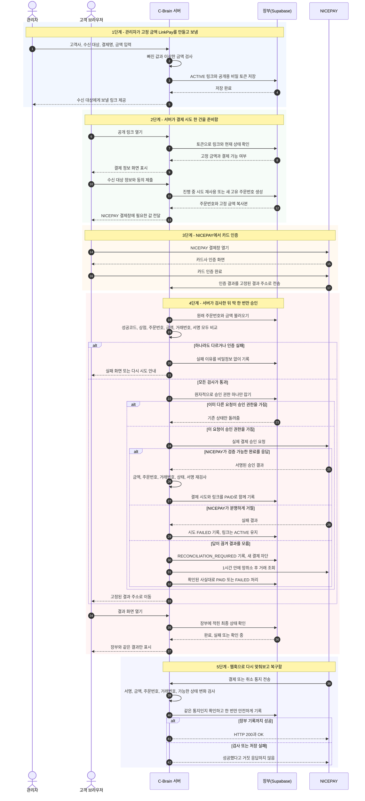
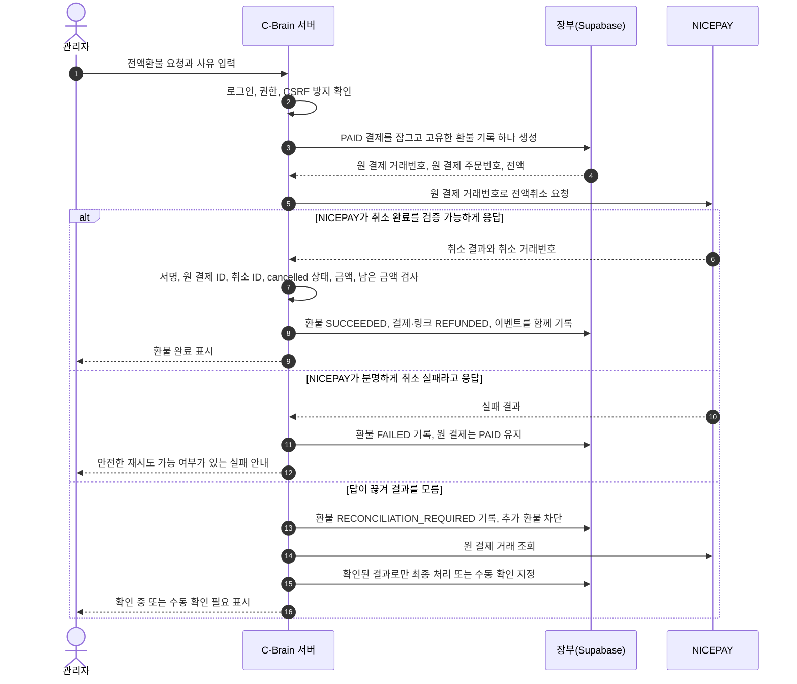

# LinkPay V2 결제 흐름 — 아주 쉽게 이해하는 설명서

**문서 상태:** 함께 확인할 기본안 v0.2

**작성일:** 2026-07-28

**개발자용 영문 문서:** [LinkPay V2 Technical Contract](./linkpay-v2-payment-flow.en.md)

## 제일 먼저 이것만 기억하면 됩니다

> 결제창에 “성공”이 떠도 아직 끝난 것이 아닙니다. 우리 서버가 NICEPAY에 다시 확인하고, 진짜 결제 완료 답을 받은 뒤 장부에 기록해야 결제 완료입니다.

이번에는 `feat-admin-payment`의 고유 코드, SQL, 테스트를 가져오지 않습니다. 현재 `dev`에서 출발해, 관리자가 LinkPay 결제 링크를 만드는 기능만 살리고 실제 결제 부분은 처음부터 다시 만듭니다.

## 등장인물: 누가 무엇을 하고, 절대 무엇을 하면 안 되나요?

| 실제 이름     | 쉬운 비유                | 하는 일                                                                                     | 절대 하면 안 되는 일                                                      |
| ------------- | ------------------------ | ------------------------------------------------------------------------------------------- | ------------------------------------------------------------------------- |
| 관리자        | 청구서를 만드는 사람     | 고객사와 수신 대상을 적고, 결제명·금액을 정해 링크를 보냅니다. 나중에 전액환불을 요청합니다 | 결제 시도가 생긴 링크의 금액·결제명을 바꾸거나, 그 링크를 완전히 삭제하기 |
| 고객 브라우저 | 손님이 보는 창           | 수신 대상의 정보와 동의를 받고 NICEPAY 카드 인증 창을 엽니다                                | 진짜 금액이나 최종 결제 상태를 결정하기                                   |
| C-Brain 서버  | 계산 담당 직원           | 입력을 검사하고, 비밀키를 보관하고, 승인·복구·환불을 처리합니다                             | 브라우저나 NICEPAY 요청 내용을 검사 없이 믿기                             |
| Supabase      | 절대 지우면 안 되는 장부 | 결제·환불의 확정 기록과 변경 이력을 오래 보관합니다                                         | 서비스용 강한 권한을 브라우저에 주기                                      |
| NICEPAY       | 카드 결제 창구           | 카드 인증, 실제 승인, 취소와 거래 조회를 처리합니다                                         | 고객 화면에 바로 “결제 완료”라고 확정해 주는 유일한 근거가 되기           |

결제 링크는 **청구서**, 결제 시도는 **카드를 한 번 긁어본 기록**, 이벤트 기록은 **CCTV와 업무일지**, 환불 기록은 **취소 전표**라고 생각하면 됩니다.

## 전체 흐름 그림

## 위 그림을 말로 다시 설명하면

### 0. 관리자가 청구서를 만듭니다

관리자가 “A 고객사의 B 수신 대상에게 디자인비 100,000원을 받겠다”라고 입력합니다. 서버가 금액을 저장하고, 수신 대상에게 보낼 주소를 하나 만듭니다.

이때부터 **진짜 금액은 서버 장부에 저장된 100,000원**입니다. 고객 화면에서 1원이나 1,000,000원으로 바꿔 보내도 서버는 무시합니다.

### 1. 고객이 결제 링크를 엽니다

서버는 다음 내용을 확인합니다.

- 실제로 존재하는 링크인가?
- `ACTIVE` 상태인가? 관리자가 사용 중지하지 않았는가?
- 이미 결제되거나 환불된 링크는 아닌가?
- 얼마를 받아야 하는가?

정상일 때만 결제 화면을 보여줍니다. 공개 링크의 토큰은 주소를 아는 사람이 장부를 훑는 열쇠가 되면 안 되므로, 충분히 길고 추측 불가능해야 하며 로그·분석 도구·오류 화면에 그대로 남기지 않습니다. 토큰을 맞혀 보려는 요청은 속도를 제한합니다.

### 2. 고객이 정보를 입력하고 결제 버튼을 누릅니다

서버는 고유한 주문번호를 만들고, 그 순간의 결제금액을 결제 시도 기록에 복사합니다.

**첫 결제 시도가 하나라도 생성된 뒤에는 금액과 결제명 같은 상업 정보는 바꿀 수 없습니다. 바꾸려면 관리자가 새 링크를 만들어야 합니다.**

고객이 결제 버튼을 두 번 눌러도, 아직 살아 있는 결제 시도를 재사용합니다. 이 “살아 있음”에는 만료 시간이 있는 임대권(lease)이 붙습니다. 예를 들어 브라우저가 꺼져도 영원히 잠기지 않도록 정해진 시간이 지나면 만료되지만, 승인 요청이 시작된 시도나 결과를 모르는 시도는 절대 임의로 풀지 않습니다.

두 브라우저가 같은 링크를 동시에 열어도 괜찮습니다. 화면의 약속이 아니라 **DB 제약조건과 한 번에 처리되는 잠금**이 “성공 결제는 링크당 딱 한 건”만 허용합니다. 그래서 두 사람이 동시에 눌러도 둘 다 승인 가능한 결제 시도를 만들 수 없습니다.

### 3. NICEPAY 결제창에서는 카드 인증만 먼저 합니다

고객이 카드 비밀번호나 앱 인증을 완료합니다. 이 단계는 “이 카드를 사용할 수 있는 사람인지 확인했다”는 뜻입니다.

아직 우리 장부에는 결제 완료라고 적지 않습니다. NICEPAY가 보내는 인증 결과는 항상 미리 정해 둔 우리 서버의 결과 주소로만 받습니다. 브라우저가 넘긴 `returnUrl`이나 주소창의 `success` 글자는 믿지 않습니다.

### 4. 서버가 검사한 뒤 실제 승인을 요청합니다

우리 서버는 다음 항목이 처음 저장한 값과 모두 같은지 확인합니다.

1. 인증 성공 코드인가?
2. 우리 NICEPAY 상점 정보가 맞는가?
3. 주문번호가 맞는가?
4. 결제금액이 맞는가?
5. 거래번호가 맞는가?
6. 비밀키로 계산한 전자 서명이 맞는가?

하나라도 다르면 NICEPAY에 승인 요청을 보내지 않습니다. 검사를 통과한 요청도 DB에서 “내가 이 주문 승인을 맡는다”는 권한을 하나만 얻은 경우에만 승인 API를 호출합니다. 같은 인증 결과가 두 번 오거나 두 브라우저가 동시에 움직여도 두 번째 요청은 다시 승인하지 않고 기존 상태만 보여줍니다.

비밀키는 오직 서버에만 있습니다. 브라우저 코드, 브라우저가 내려받는 환경변수, DB의 공개 데이터, 로그 어디에도 들어가면 안 됩니다. 운영 중 키를 바꿀 수 있도록 키 회전 절차와 이전 키를 안전하게 교체하는 절차도 배포 전에 준비합니다.

### 5. 인터넷이 끊겨 결과를 모르면 “실패”라고 하지 않습니다

NICEPAY 승인 요청 뒤 읽기 타임아웃이 나면 돈이 빠졌는지 아직 모릅니다. 서버는 즉시 `RECONCILIATION_REQUIRED`(결제 확인 필요)로 기록하고 새 결제를 막습니다.

그 뒤에는 다음 순서로 복구합니다.

1. NICEPAY 안내에 따라 **1시간 안에 망취소**를 시도합니다.
2. NICEPAY 거래 조회와 서명된 웹훅으로 실제 결과를 확인합니다.
3. 확인 가능한 사실이 있으면 `PAID` 또는 `FAILED`로 바꿉니다.
4. 그래도 확인할 수 없으면 `MANUAL_REVIEW`(사람 확인 필요) 목록으로 넘깁니다. 고객에게 다시 결제하라고 말하지 않습니다.

망취소는 관리자 환불이 아닙니다. 승인 직후 통신이 끊겼을 때만 쓰는 긴급 복구입니다. 이 과정은 브라우저 요청이 사라져도 멈추지 않도록, 장부에서 다시 이어 할 수 있는 내구성 있는 복구 작업자가 처리합니다.

### 6. 고객 결과 화면은 장부를 읽습니다

새로고침하거나 다른 휴대폰에서 열어도 서버 장부에 적힌 결과를 보여줍니다. 주소에 `success`라는 글자가 있거나 브라우저가 성공했다고 말하는 것은 증거가 아닙니다.

### 7. NICEPAY 웹훅은 배달 확인 전화와 같습니다

웹훅은 NICEPAY가 나중에 “이 주문은 정말 결제됐습니다” 또는 “이 결제는 취소됐습니다”라고 서버에 다시 알려주는 통지입니다.

같은 통지가 여러 번 와도 고유한 통지 키로 한 번만 기록합니다. 통지가 늦게 오거나 순서가 뒤집혀 와도, 현재 상태에서 허용되는 변화인지 확인한 경우에만 바꿉니다. 예를 들어 이미 `REFUNDED`인 건을 늦은 결제 통지가 다시 `PAID`로 되돌릴 수 없습니다. 서명과 금액을 검사하고 장부 저장까지 성공한 다음에만 NICEPAY에 `OK`라고 답합니다.

## 결제 상태를 신호등처럼 이해하기

| 화면에 보여줄 말 | 내부 상태                 | 뜻                                     | 고객이 다시 결제해도 되나?        |
| ---------------- | ------------------------- | -------------------------------------- | --------------------------------- |
| 결제 준비        | `CREATED`                 | 주문번호는 만들었지만 아직 승인 전     | 같은 살아 있는 시도를 이어서 사용 |
| 결제 준비 만료   | `EXPIRED`                 | 승인 시작 전에 준비 시간이 지남        | 새 주문번호로 가능                |
| 결제 처리 중     | `APPROVAL_PENDING`        | NICEPAY에 실제 승인을 요청하는 중      | 안 됨                             |
| 결제 완료        | `PAID`                    | NICEPAY 승인 검증과 장부 기록까지 완료 | 안 됨                             |
| 결제 실패        | `FAILED`                  | 돈이 빠져나가지 않았다는 사실이 분명함 | 새 주문번호로 가능                |
| 결제 확인 중     | `RECONCILIATION_REQUIRED` | 돈이 나갔는지 아직 확실하지 않음       | 절대 안 됨                        |
| 사람 확인 필요   | `MANUAL_REVIEW`           | 자동 확인 기한이 지나도 결과를 모름    | 절대 안 됨                        |
| 환불 완료        | `REFUNDED`                | 전액취소를 확인하고 장부에도 기록함    | 이 링크로는 안 됨                 |

가장 중요한 상태는 `RECONCILIATION_REQUIRED`입니다. 이 상태를 억지로 실패라고 바꾸면 고객이 다시 결제해서 돈이 두 번 빠질 수 있습니다. **모르면 실패 처리하지 말고, 확인될 때까지 새 결제를 막습니다.**

## LinkPay 링크 자체의 상태와 관리자 규칙

| 링크 상태  | 뜻                             | 수정                              | 삭제                              | 사용 중지                        |
| ---------- | ------------------------------ | --------------------------------- | --------------------------------- | -------------------------------- |
| `ACTIVE`   | 아직 결제 받을 수 있는 새 링크 | 결제 시도가 하나도 없을 때만 가능 | 결제 시도가 하나도 없을 때만 가능 | 가능. 그러면 새 결제를 받지 않음 |
| `DISABLED` | 관리자가 새 결제를 막은 링크   | 결제 시도가 하나도 없을 때만 가능 | 결제 시도가 하나도 없을 때만 가능 | 이미 중지된 상태. 과거 기록은 봄 |
| `PAID`     | 결제가 확정된 링크             | 불가                              | 불가                              | 새 결제는 이미 불가              |
| `REFUNDED` | 전액환불까지 확정된 링크       | 불가                              | 불가                              | 새 결제는 이미 불가              |

결제 시도가 하나라도 생긴 링크는 이후 **수정도 완전 삭제도 할 수 없습니다.** 필요하면 `DISABLED`로만 막고, 장부와 감사 이력은 남깁니다. 다만 사용 중지는 이미 진행 중인 승인이나 결과 확인 작업을 취소하지 않습니다. 그 결제가 나중에 실제 성공으로 확인되면 링크는 `PAID`가 되고, 필요하면 정상 전액환불 절차를 밟습니다.

환불된 링크를 다시 열어 결제받는 일도 없습니다. 환불은 돈을 돌려준 것이지 “성공 결제가 없었던 일”이 된 것이 아닙니다. DB는 `PAID`와 `REFUNDED`를 모두 성공 결제 이력으로 세어 두 번째 성공 결제를 막습니다. 다시 돈을 받아야 하면 새 링크를 만듭니다.

## 문제가 생겼을 때 어떻게 하나요?

| 상황                                     | 처리 방법                                                                                                                                     |
| ---------------------------------------- | --------------------------------------------------------------------------------------------------------------------------------------------- |
| 고객이 결제창을 그냥 닫음                | `PAID`로 기록하지 않습니다. 승인 진행 중이 아니면 만료된 시도 뒤 새 주문번호로 다시 시도할 수 있습니다                                        |
| 고객이 결제 버튼을 두 번 누름            | 같은 진행 중 결제 시도를 돌려주고, 두 번째 승인 가능한 시도는 만들지 않습니다                                                                 |
| 두 브라우저에서 동시에 결제              | DB가 링크당 성공 결제 한 건만 허용하므로 둘 다 돈이 빠질 수 없습니다. 한 요청만 승인 권한을 가집니다                                          |
| 누군가 화면에서 금액을 바꿈              | 서버 장부 금액과 다르므로 승인 전에 차단합니다                                                                                                |
| 같은 인증 결과가 두 번 도착함            | 첫 요청만 승인하고 두 번째 요청은 장부 상태만 확인합니다                                                                                      |
| NICEPAY가 분명하게 실패라고 답함         | 그 시도만 `FAILED`로 기록하고 새 주문번호로 다시 시도할 수 있게 합니다                                                                        |
| NICEPAY에 요청했는데 인터넷이 끊김       | 즉시 `RECONCILIATION_REQUIRED`로 잠그고 1시간 안 망취소, 거래 조회, 웹훅 확인을 합니다                                                        |
| NICEPAY는 승인했는데 장부 저장이 실패함  | 내구성 있는 복구 작업자가 거래 조회·웹훅으로 복구합니다. 고객에게 다시 결제시키지 않습니다                                                    |
| 관리자 환불 요청 뒤 답이 끊김            | 환불을 `RECONCILIATION_REQUIRED`로 잠그고 추가 취소를 보내지 않습니다. 원 거래를 조회해 취소 여부를 확인하고, 끝까지 모르면 사람이 확인합니다 |
| 같은 웹훅이 여러 번 오거나 순서가 뒤집힘 | 중복 키로 한 번만 처리하고, 허용되지 않는 이전 상태로 되돌리지 않습니다                                                                       |
| 공개 링크 토큰을 마구 추측함             | 추측 불가능한 토큰, 속도 제한, 최소한의 오류 응답으로 보호합니다                                                                              |

## 전액환불 흐름 그림

환불 버튼을 두 번 눌러도 환불 기록은 결제 한 건당 **하나만** 만듭니다. 이미 있는 환불 요청을 보여주거나 재사용할 뿐, NICEPAY 취소 요청을 두 번 보내지 않습니다.

환불 상태는 다음 네 가지입니다.

| 상태                      | 쉬운 뜻                                                 | 다음 행동                                                 |
| ------------------------- | ------------------------------------------------------- | --------------------------------------------------------- |
| `REQUESTED`               | 환불 전표를 만들고 NICEPAY 취소를 시작함                | 같은 환불을 중복 생성하지 않음                            |
| `SUCCEEDED`               | 원 결제 ID와 취소 ID, 전액, 남은 금액 0원을 모두 확인함 | 결제와 링크를 `REFUNDED`로 끝냄                           |
| `FAILED`                  | NICEPAY가 취소가 안 됐다고 분명히 알려줌                | 원 결제는 `PAID`로 유지하고, 안전한 경우에만 다시 시도    |
| `RECONCILIATION_REQUIRED` | 취소가 됐는지 모름                                      | 추가 환불을 막고 거래 조회·웹훅·수동 확인으로 사실을 확인 |

NICEPAY 밖에서 이미 취소됐거나, 부분 취소가 발견됐거나, 취소 ID·원 결제 ID·금액이 맞지 않으면 시스템이 “전액환불 완료”라고 거짓말하지 않습니다. `RECONCILIATION_REQUIRED`로 남기고 사람이 NICEPAY 거래와 장부를 확인합니다. 1차 버전은 부분환불을 지원하지 않습니다.

참고로 **망취소**와 **일반 환불**은 다릅니다.

- 망취소: 결제 승인 중 인터넷이 끊겨 성공인지 실패인지 모를 때 쓰는 긴급 복구
- 일반 환불: 이미 결제가 완료된 뒤 관리자가 돈을 돌려줄 때 쓰는 전액취소 API

## 장부에는 무엇을 저장하나요?

| 장부        | 쉬운 의미        | 저장하는 내용                                                                          |
| ----------- | ---------------- | -------------------------------------------------------------------------------------- |
| 결제 링크   | 청구서           | 결제명, 고정 금액, 고객사, 수신 대상, 공개 토큰, 링크 상태                             |
| 결제 시도   | 카드를 긁은 기록 | 고유 주문번호, 금액 복사본, 최소 수신 대상 정보, 거래번호, 진행 상태, 임대권 만료 시각 |
| 결제 이벤트 | CCTV·업무일지    | 언제 인증·승인·실패·웹훅·복구가 있었는지, 중복 방지 키                                 |
| 환불        | 취소 전표        | 원 결제 ID, 취소 ID, 고유 환불 주문번호, 사유, 상태, 요청자, 시각                      |

카드번호, CVC, NICEPAY 비밀키, 인증 토큰, 원본 결제 요청 전문은 저장하거나 로그에 찍지 않습니다. 수신 대상의 이름, 전화번호, 이메일, 선택 회사명, 동의한 약관 버전과 시간처럼 실제 결제에 필요한 최소 정보만 저장합니다.

개인정보를 몇 년 보관할지는 회사의 확정된 개인정보 처리방침을 따라야 합니다. 이 문서에서 법적 보관기간을 임의로 만들지 않습니다. 실제 배포 전에 약관 문구, 버전, 보관기간을 사업 담당자가 확정해야 합니다.

브라우저는 자기에게 허용된 공개 화면 데이터만 읽습니다. 결제·환불 장부와 서비스용 강한 권한은 서버만 접근하며, Supabase RLS 정책도 이를 강제합니다. 관리자의 환불 요청은 로그인만으로 충분하지 않습니다. 해당 권한과 CSRF 방지를 함께 확인합니다.

## 이번에 살리는 것과 버리는 것

### 살리는 것

- 어드민 LinkPay 목록
- 결제 링크 생성·수정 폼
- 고객사, 수신 대상, 결제명, 금액 등을 입력하는 규칙
- 링크 복사 기능
- 관리자 로그인과 권한 확인

### 새로 만드는 것

- 실제 링크 주소로 DB 데이터를 읽는 고객 화면
- 결제 시도 생성과 임대권 만료 처리
- NICEPAY 결제창 연결
- 인증 결과 검사와 서버 승인
- 결제 결과 화면
- 웹훅과 내구성 있는 결과 복구 작업
- 결제·이벤트·환불 장부
- 권한·CSRF 보호가 있는 어드민 전액환불

### 사용하지 않는 것

- `feat-admin-payment`의 고유 코드, SQL, 테스트 전체
- 현재 fixture에만 존재하는 가짜 LinkPay 결제 결과
- 현재의 연결되지 않은 결제 주문 흐름
- 환불 내역 없이 결제 행의 숫자만 바꾸는 방식

브랜치를 폐기해도 원격 DB에 이미 적용된 SQL은 자동으로 사라지지 않습니다. 새 SQL을 만들기 전에 실제 Supabase의 테이블, 컬럼, 제약조건, 정책, 트리거, 함수를 읽어서 확인합니다. 예전 migration 파일은 고치지 않고 앞으로 진행하는 migration만 추가합니다.

예전 `payment_orders` 등 불필요해진 장부를 삭제하거나 구조를 크게 바꾸는 작업은 **샌드박스와 운영 전환 검증이 끝난 뒤에만** 합니다. 먼저 새 흐름이 안전하게 작동함을 확인하고, 필요한 보관·백업·전환 계획을 승인받은 뒤에만 파괴적인 정리를 합니다.

## 1차 버전에 포함되는 것

- LinkPay 카드 결제
- 원화 고정금액
- 한 링크당 성공 결제 한 번
- 실패 후 안전한 재시도
- 두 브라우저에서도 안전한 중복 결제 방지
- 결과를 모를 때 자동 차단과 복구
- NICEPAY 웹훅
- 관리자 전액환불
- 새로고침해도 유지되는 결과 화면

## 1차 버전에서 하지 않는 것

- 부분환불
- 가상계좌, 계좌이체, 휴대폰 결제
- 정기결제
- 일반 상품 주문 `/order` 결제
- **모든 일반 매출·정산 통계**
- 환불된 링크 재사용

## 출시 전에 반드시 통과할 확인 목록

아래를 모두 통과하기 전에는 실제 고객 결제를 열지 않습니다.

- 테스트가 정상·실패·중복·권한 없음·잘못된 금액/서명/ID·허용되지 않는 상태 변경을 모두 검사한다.
- DB 테스트가 한 링크의 성공 결제 한 건, 살아 있는 결제 시도 한 건, 첫 시도 뒤 금액·결제명 수정 불가, 환불 기록 한 건, 이벤트 중복 방지를 증명한다.
- NICEPAY 샌드박스에서 정상 카드결제, 고객 인증 취소, 조작된 인증 결과, 중복 인증 결과, 웹훅 재전송, 승인 타임아웃 복구, 전액환불, 중복 환불, 거래 조회를 모두 해본다.
- 브라우저 두 개에서 동시에 결제해도 한 번만 승인되는지, 새로고침과 다른 브라우저의 결과 화면이 서버 장부와 같은지 확인한다.
- 로그에는 추적 번호와 NICEPAY 결과 코드만 남고 비밀키·인증 토큰·카드정보·불필요한 수신 대상 정보가 남지 않는지 확인한다.
- 실제 Supabase 스키마·제약조건·RLS 정책과 배포 환경변수·고정 결과 주소·키 회전 설정을 배포 직전에 확인한다.
- 작은 실제 운영 결제를 한 건 완료하고, 그 결제를 전액취소하여 장부와 NICEPAY가 모두 맞는지 확인한 뒤 출시 승인한다.

## 개발을 시작하기 전에 함께 확인할 여섯 가지

이 문서는 아래 내용을 기본안으로 정했습니다. 바꾸고 싶은 항목만 말해주면 됩니다.

1. 첫 버전은 카드 결제만 지원한다.
2. 환불은 전액환불만 지원한다.
3. 결제 또는 환불 결과를 모르면 새 작업을 막고 먼저 확인한다.
4. 한 번 결제하거나 환불한 링크는 다시 사용하지 않는다.
5. 첫 결제 시도가 생기면 금액과 결제명은 바꾸지 못하고 새 링크를 만든다.
6. 모든 일반 매출·정산 통계는 이번 범위에 넣지 않는다.

이 여섯 가지가 맞다면 다음 단계에서 화면이 아니라 **DB 장부와 상태 규칙부터** 작은 테스트로 만들고, 그다음 NICEPAY 샌드박스를 연결합니다.

## NICEPAY 공식 참고자료

- [결제창과 서버 승인](https://github.com/nicepayments/nicepay-manual/blob/main/api/payment-window-server.md)
- [NICEPAY Start 빠른 시작](https://start.nicepay.co.kr/manual/quickguide/overview.do)
- [거래 상태 조회](https://github.com/nicepayments/nicepay-manual/blob/main/api/status-transaction.md)
- [취소·환불·망취소](https://github.com/nicepayments/nicepay-manual/blob/main/api/cancel.md)
- [웹훅](https://github.com/nicepayments/nicepay-manual/blob/main/api/hook.md)
- [통신 타임아웃 처리](https://github.com/nicepayments/nicepay-manual/blob/main/common/preparations.md)
